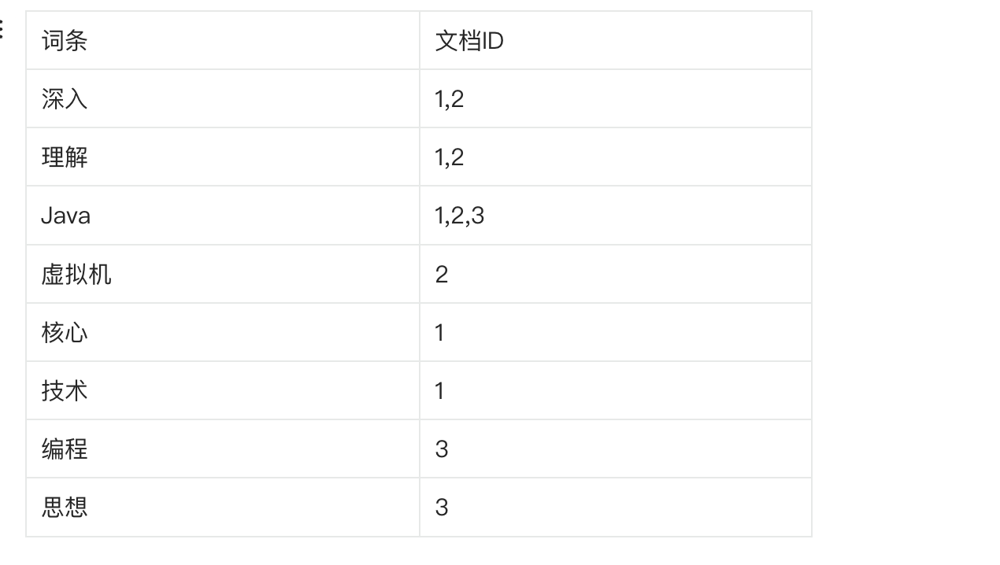

# ElasticSearch

## 为什么要使用elasticsearch
***1、*** 搜索引擎：用于快速检索文档、商品、新闻等
***2、*** 日志分析：通过分析日志，帮助企业了解其业务的性能情况
***3、*** 数据分析：帮助数据科学家和数据分析师进行数据分析，获取有价值的信息
***4、*** 商业智能：帮助企业定制数据驱动的决策，实现商业上的成功
***5、*** 实时监控：帮助企业实时监测系统性能、监控数据变化、保证系统的正常运行
***6、*** 安全性：帮助企业保证数据的安全性，保证数据不被非法窃取
***7、*** 应用程序开发：帮助开发人员开发基于搜索的应用程序，以增加用户体验

## 优势
***1、*** 高性能：Elasticsearch具有高性能的搜索和分析能力，其中涵盖了多种查询语言和数据结构  

***2、*** 可扩展性：Elasticsearch是分布式的，可以通过增加节点数量扩展搜索和分析能力  

***3、*** 灵活性：Elasticsearch支持多种数据类型，支持多种语言，支持动态映射，允许快速地调整模型以适应不同的需求

***4、*** 实时分析：Elasticsearch支持实时分析，可以对数据进行实时查询，这对于快速检索数据非常有用

***5、*** 可靠性：Elasticsearch具有可靠性的高可用性，支持数据备份和恢复

## 为什么这么快
***1、*** 分布式存储：Elasticsearch使用分布式存储技术，将数据存储在多个节点上，从而减少单个节点的压力，提高整体性能

***2、*** 索引分片：Elasticsearch把每个索引划分成多个分片，这样可以让查询操作并行化，从而提高查询速度

***3、*** 全文索引：Elasticsearch使用了高效的全文索引技术，把文档转化成可搜索的结构化数据，使得搜索操作快速高效

***4、*** 倒排索引：Elasticsearch支持倒排索引这种数据结构，倒排索引将文档中的每个词与这个词出现在哪些文档中进行映射，并存储这些信息，当搜索请求发生的时候
Es可以快速查找包含所有搜索词的文档，从而返回结果

***5、*** 预存储结果：ES在插入数据时，对数据进行预处理，把结果存储到索引中，从而在查询时候不需要在重新计算，提高查询速度

***6、*** 索引优化：ES通过优化索引技术，可以使查询速度更快，例如，它支持索引覆盖，索引下推等优化技术，使得查询速度更快

***7、*** 高效的查询引擎：ES使用了高效的查询引擎，支持各种类型的查询，并对复杂查询提供了优化策略，从而提高查询速度

***8、*** 异步请求处理：ES使用了异步请求处理机制，能够在请求到达时立即返回，避免长时间的等待，提高用户体验

***9、*** 内存存储：ES使用了内存存储技术，能够在读写数据时大大减少

总之，ES快的原因在于它使用了各种高效的技术，使得数据存储、查询、处理都变得更加高效，从而实现了快速的搜索

## 倒排索引
在ES中，倒排索引是一种常用的索引结构，用于快速搜索文档中的某个词汇  

倒排索引的结构与传统的索引结构相反，传统的索引结构是由文档构成的，每个文档包含了若干的词汇，然后根据这些词汇建立索引，而倒排索引是由词汇构成的，每个词汇对应了若干的文档，然后根据这些文档建立索，对于一个包含多个词汇的文档，倒排索引会将每个词汇作为一个关键字，然后记录下该词汇所在文档编号以及该词汇在文档中的位置，这样我们输入一个关键字时候，可以快速查找到包含该关键字的文档编号，然后通过文档编号在查找到对应的文档内容  
它的优点在于它可以快速定位包含关键词的文档，而且可以支持复杂的搜索操作，如词组搜索、通配符搜索等，同时，由于倒排索引是由词汇构成的，因此在进行数据分析和统计的时候也非常有用，在ES中，倒排索引是一种非常重要的索引结构，他被广泛应用于搜索引擎、日志分析、推荐系统等领域 

## 如何保证ES和数据库的数据一致性
***1、*** 双写，在代码中对数据库和ES进行双写，并且先操作本地数据库，在操作ES，而且还需要把两个操作放在以一个事物中，如果写ES超时的话会导致数据不一致，那么需要重试来保证最终一致性，优点就是简单实时性比较高，缺点就是代码侵入，并且在本地事物汇总发生了外调，大大拖长了事物，白白占用数据库链接，影响整体的吞吐量  

***2、*** MQ异步消费，比如要更新数据库了就发送一个鹅消息，然后数据库和ES各自由一个监听者，监听消息之后各自去做数据变更，如果失败了就基于消息的重试在重新执行，或者可以采用本地消息表解决，先操作DB，然后异步通知ES更新，这个时候可以借助本地消息表的方式保证最终一致，缺点就是MQ可能存在延迟，并且引入了新的组件 优点就是解耦、异步，提升整体性能  

***3、*** 扫表定时同步，如果ES中的数据变更的实时性要求不高，可以考虑定时任务扫表，然后批量更新ES，优点就是没有侵入性，数据库的写操作不需要改代码 缺点就是实时性很差，并且轮训可能存在性能问题
效率问题还给数据库带来了压力  

***4、*** 监听binlog，通过监听binlog来更新ES中的数据，优点对业务代码没有侵入，解耦，不需要关心ES的更新操作 缺点就是需要基于binlog，需要引入第三方框架，存在一定的延迟

总结：业内流行的解决方案是基于binlog监听，首先业务量小的也不太需要ES，所以用了ES的团队，一般并不会关心引入新框架的问题，而且ES这种搜索，一般来说，毫秒级别的延迟都是可以接受的，所以我们可以基于canal来做数据同步的方案