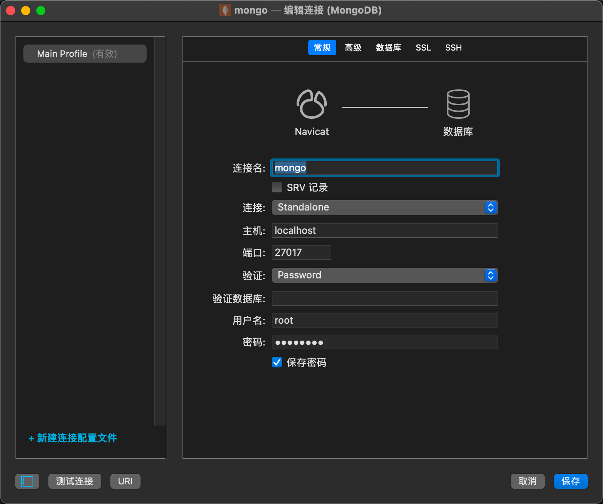

# 使用Docker

***1、*** 先获取mongoDB镜像  
```
docker pull mongo:4.2
```
***2、*** 镜像拉取完成后，运行mongoDB容器
```
docker run \
-d \
--name mongo \
--restart=always \
--privileged=true \
-p 27017:27017 \
-v /home//mongodb/data:/data/db \
mongo:4.2 --auth
```
***3、*** mongoDB服务配置  
mongodb起来以后，进入容器，配置账户，具体执行命令如下：
```
#进入容器
docker exec -it mongo /bin/bash
#登录mobodb
mongo admin 
#创建一个名为 root，密码为 123456 的用户。
db.createUser({ user:'root',pwd:'123456',roles:[{ role:'userAdminAnyDatabase', db: 'admin'},"readWriteAnyDatabase"]});
```
***4、*** 容器内部测试是否可用  
登陆mongodb数据库，创建集合users,验证数据库可以是否正常使用,命令如下:  
```
#尝试使用上面创建的用户信息进行连接。
db.auth('root', '123456')
#选择admin库
use admin
#创建集合users
db.createCollection('users')
#插入数据
db.users.insert({"name":"小李","age": NumberInt(33)})
#查看数据
db.users.find()
```
***5、*** 本地navicat客户端链接mongodb  
首先保证服务器开启27017端口,然后用公网IP加27017测试是否能够访问(服务器要开放27017端口)  
用navicat链接
  
如果链接成功,打开数据库可能什么都看不到,需要选择navicat菜单栏查看按钮把显示隐藏项目勾选上就可以了