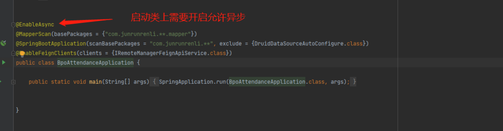
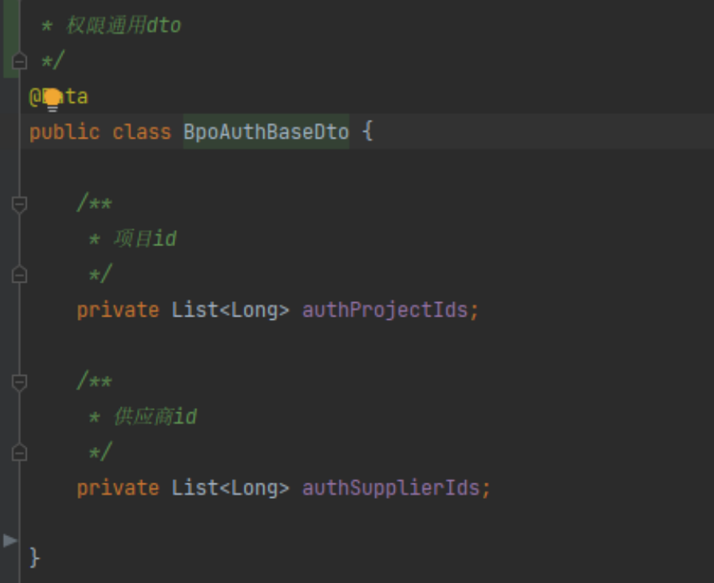

# 玩转自定义注解
注解是一种能被添加到Java代码中的元数据，类、方法、变量、参数和包都可以用注解来修饰，注解对于它所修饰的代码并没有直接的影响  
注解其实就是一种标记，他可以在程序代码中的关键的一些节点比如类、方法、变量、参数、包上打上这些标记，然后程序在编译的时候或运行  
时可以检测到这些标记而执行一些特殊操作，比如结合AOP通过反射获取请求参数或者返回参数进行相应的业务逻辑后改变请求值后者返回值，  
结合过滤器、拦截器进行  

## 步骤  
1、定义注解：相当于标记  
2、配置注解，把标记打到需要用到的程序代码中，类、方法、变量或者参数等  
3、解析注解，在编译期或运行时检测到标记，并进行相应的业务处理

## 举例  
1、请求参数自动注入吗，自动填充或者转换参数，例如自动加解密、自动填充权限字段等  
2、自定义校验请求参数，基于JSR303编写自己的校验注解  
3、改变返回参数，自动翻译字典值、枚举值等，减少前端工作
4、sql自动拼接，xml内sql自动拼接逻辑删除标识，摆脱重复工作，专注业务  

## 举例1：自动填充dto内权限参数注解 @ AutoFillAuthFields
业务背景介绍：bpo数据权限复杂，当查询进来的时候需要根据当前登录人组装其拥有的权限请求数据，往查询方法内传，这一部分代码的逻辑只跟当前登录人有关，  
所以抽取出来，哪个方法要用的话只需要在方法上加个注解，其权限请求参数就会自动填充进去，简化了逻辑。

  
  
  
  
  
  
  
  
