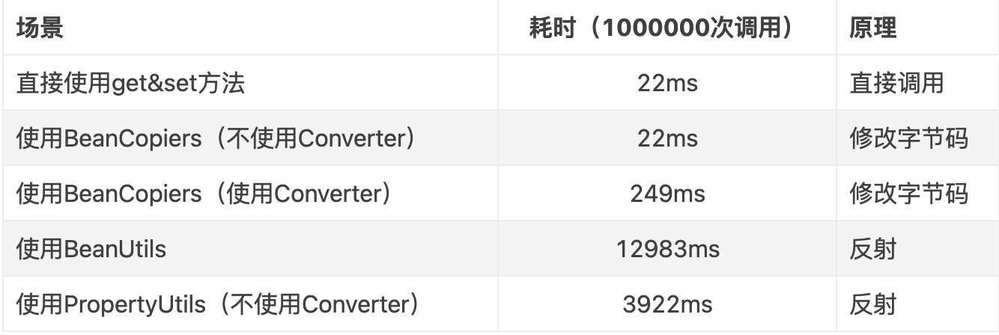

# BeanCopier

## BeanCopier实现
BeanCopier是用于在两个类之间进行属性复制的工具类，它的实现原理是通过动态生成字节码来实现的，因此性能非常高，比反射要快很多。  
BeanCopier的使用非常简单，只需要调用BeanCopier.create()方法即可，该方法接收三个参数，分别是源类的Class对象、目标类的Class对象和是否使用Converter的标志位。  
它支持两种方式，一种是不使用Converter的方式，仅仅对两个bean间属性名和类型相同的属性进行复制，另一种是使用Converter的方式，可以对某些特定属性值进行特殊操作  
不使用Converter的例子  
```
    public void testSimple() {
        // 动态生成用于复制的类,false为不使用Converter类
        BeanCopier copier = BeanCopier.create(MA.class, MA.class, false);

        MA source = new MA();
        source.setIntP(42);
        MA target = new MA();

        // 执行source到target的属性复制
        copier.copy(source, target, null);

        assertTrue(target.getIntP() == 42);
    }
```
使用Converter的例子  
```
    public void testConvert() {
        // 动态生成用于复制的类,并使用Converter类
        BeanCopier copier = BeanCopier.create(MA.class, MA.class, true);

        MA source = new MA();
        source.setIntP(42);
        MA target = new MA();

        // 执行source到target的属性复制
        copier.copy(source, target, new Converter() {

            /**
             * @param sourceValue source对象属性值
             * @param targetClass target对象对应类
             * @param methodName targetClass里属性对应set方法名,eg.setId
             * @return
             */
            public Object convert(Object sourceValue, Class targetClass, Object methodName) {
                if (targetClass.equals(Integer.TYPE)) {
                    return new Integer(((Number)sourceValue).intValue() + 1);
                }
                return sourceValue;
            }
        });

        assertTrue(target.getIntP() == 43);
    }
```
核心代码只有两行  
1、copier = BeanCopier.create 生成用于两个bean间进行复制的类  
2、copier.copy 执行复制操作  
## 性能分析  
BeanCopier的性能非常高，比反射要快很多，下面是我在我的电脑上的测试结果  

```
    public void testPerformance() {
        int count = 1000000;
        long start = System.currentTimeMillis();
        for (int i = 0; i < count; i++) {
            BeanCopier copier = BeanCopier.create(MA.class, MA.class, false);
            MA source = new MA();
            source.setIntP(42);
            MA target = new MA();
            copier.copy(source, target, null);
        }
        long end = System.currentTimeMillis();
        System.out.println("BeanCopier cost " + (end - start) + " ms");

        start = System.currentTimeMillis();
        for (int i = 0; i < count; i++) {
            MA source = new MA();
            source.setIntP(42);
            MA target = new MA();
            target.setIntP(source.getIntP());
        }
        end = System.currentTimeMillis();
        System.out.println("Direct cost " + (end - start) + " ms");

        start = System.currentTimeMillis();
        for (int i = 0; i < count; i++) {
            MA source = new MA();
            source.setIntP(42);
            MA target = new MA();
            try {
                PropertyUtils.copyProperties(target, source);
            } catch (IllegalAccessException e) {
                e.printStackTrace();
            } catch (InvocationTargetException e) {
                e.printStackTrace();
            } catch (NoSuchMethodException e) {
                e.printStackTrace();
            }
        }
        end = System.currentTimeMillis();
        System.out.println("PropertyUtils cost " + (end - start) + " ms");

        start = System.currentTimeMillis();
        for (int i = 0; i < count; i++) {
            MA source = new MA();
            source.setIntP(42);
            MA target = new MA();
            try {
                BeanUtils.copyProperties(target, source);
            } catch (IllegalAccessException e) {
                e.printStackTrace();
            } catch (InvocationTargetException e) {
                e.printStackTrace();
            }
        }
        end = System.currentTimeMillis();
        System.out.println("BeanUtils cost " + (end - start) + " ms");
    }
```
## 3、一次调用流程  
1、CGLIB的核心是在于通过字节码生成类,来实现原本需要通过反射或者一堆代码才能实现的逻辑。我们在刚刚不带Converter的例子,CGLIB在背后悄悄给我们生成了两个类,
我们可以窥探一下这两个生成类  
第一个类
```
public class MA$$BeanCopierByCGLIB$$d9c04262 extends BeanCopier {
    public MA$$BeanCopierByCGLIB$$d9c04262() {
    }

    public void copy(Object var1, Object var2, Converter var3) {
        MA var10000 = (MA)var2;
        MA var10001 = (MA)var1;
        var10000.setBooleanP(((MA)var1).isBooleanP());
        var10000.setByteP(var10001.getByteP());
        var10000.setCharP(var10001.getCharP());
        var10000.setDoubleP(var10001.getDoubleP());
        var10000.setFloatP(var10001.getFloatP());
        var10000.setId(var10001.getId());
        var10000.setIntP(var10001.getIntP());
        var10000.setLongP(var10001.getLongP());
        var10000.setName(var10001.getName());
        var10000.setShortP(var10001.getShortP());
        var10000.setStringP(var10001.getStringP());
    }
}
```
它是通过生成拷贝属性值代码来完成我们需要的拷贝逻辑,这个生成类也就是我们前面例子里的copier(BeanCopier copier = BeanCopier.create(MA.class, MA.class, false))对应的类  
第二个类
```
public class BeanCopier$BeanCopierKey$$KeyFactoryByCGLIB$$f32401fd extends KeyFactory implements BeanCopierKey {
    // 源类名
    private final String FIELD_0;
    // 目标类名
    private final String FIELD_1;
    // 是否使用Converter
    private final boolean FIELD_2;

    public BeanCopier$BeanCopierKey$$KeyFactoryByCGLIB$$f32401fd() {
    }

    public Object newInstance(String var1, String var2, boolean var3) {
        return new BeanCopier$BeanCopierKey$$KeyFactoryByCGLIB$$f32401fd(var1, var2, var3);
    }

    public int hashCode() {
        return ((95401 * 54189869 + (this.FIELD_0 != null?this.FIELD_0.hashCode():0)) * 54189869 + (this.FIELD_1 != null?this.FIELD_1.hashCode():0)) * 54189869 + (this.FIELD_2 ^ 1);
    }

    public boolean equals(Object var1) {
          ...
    }

    public String toString() {
        StringBuffer var10000 = new StringBuffer();
        var10000 = (this.FIELD_0 != null?var10000.append(this.FIELD_0.toString()):var10000.append("null")).append(", ");
        return (this.FIELD_1 != null?var10000.append(this.FIELD_1.toString()):var10000.append("null")).append(", ").append(this.FIELD_2).toString();
    }
}
```
第二个类就没有第一个类那么一目了然,它这BeanCopier依赖里面core包中的KeyFactory生成的key,它作为第一个类的唯一标识,在cglib的缓存Map中作为key  
这个类包含一个默认的构造函数,一个newInstance的工厂方法用于创建新的实例,以及重写hashCode,equals,toString方法